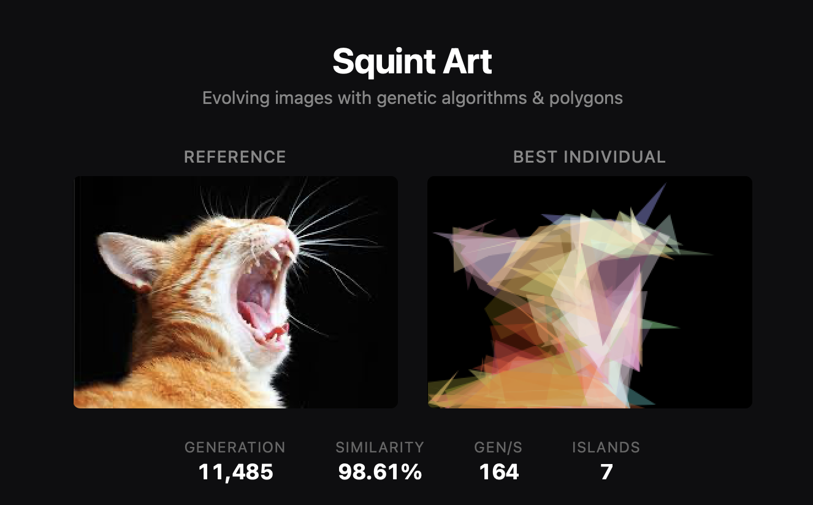

# Squint Art

A genetic algorithm that evolves polygon-based art to approximate a reference image. Drop in any image and watch as semi-transparent polygons are bred, mutated, and selected over thousands of generations to recreate it.

Named because the output looks surprisingly good if you squint.



## Quick Start

```bash
npm install
npm start        # serves on http://localhost:3000
```

Open the app, drag and drop (or click to select) a reference image, and hit **Start**. The algorithm runs across all available CPU cores automatically.

## How It Works

Each **individual** in the population is a canvas rendered from a fixed number of semi-transparent polygons. Every polygon has:
- N vertices (default 6) with normalized coordinates
- An RGBA fill color with variable opacity

The genetic algorithm evolves these canvases to minimize the pixel-level difference from the reference image:

1. **Fitness**: Render each individual to a canvas, compare pixels against the reference (sum of squared RGB differences)
2. **Selection**: Tournament selection picks parents
3. **Crossover**: Uniform crossover at the polygon level (each polygon slot comes from one parent)
4. **Mutation**: Gaussian perturbation of vertex positions, colors, and opacity, plus occasional full polygon replacement and draw-order swaps
5. **Elitism**: The best individual survives unchanged to the next generation

### Island Model

The algorithm runs as an **island model** for multi-core parallelism. On startup, it spawns `N-1` Web Workers (where N = CPU core count), each running an independent population. Every 5 seconds, the global best individual migrates to all islands, replacing each island's worst member. This provides:

- **Linear throughput scaling** across cores
- **Genetic diversity** to escape local optima (each island explores a different region of the search space)

## Tuning

Settings are accessible via the collapsible panel in the UI.

| Setting | Default | Effect |
|---------|---------|--------|
| **Population Size** | 50 | Larger = more diversity per generation, but proportionally slower |
| **Polygons** | 50 | More polygons = more expressive, but slower rendering. 25-50 is a good range for most images |
| **Vertices** | 6 | Points per polygon. 3 = triangles, higher = smoother shapes |
| **Mutation Rate** | 0.03 | Per-gene probability. Higher = more exploration, lower = more exploitation |
| **Tournament Size** | 5 | Selection pressure. Higher = greedier selection |
| **Work Resolution** | 128px | Resolution for the reference and display canvas. Higher = more detail but slower |
| **Fitness Downscale** | 2 | Divisor for the fitness evaluation canvas. 2 = fitness runs at half resolution per axis (4x fewer pixels) with no quality loss |
| **Subsample** | 1 | Pixel skip factor in the diff loop. Kept at 1 since reduced-res rendering already handles this |

**Recommended starting point**: defaults work well. If your image has fine detail, try increasing Work Resolution to 256 and Polygons to 100. If you want faster iteration, increase Fitness Downscale to 4.

## Benchmarking

A headless Node.js benchmark runner is included:

```bash
npm run bench                          # uses reference.jpg
npm run bench -- path/to/image.jpg     # custom image
```

This runs a matrix of configurations, reports gen/s and full-resolution similarity for each, and saves detailed JSON results to the `benchmark/` directory. The benchmark uses `worker_threads` for real multi-core measurement of the island model.

## Performance Chart

The built-in performance chart (below the controls in the UI) tracks similarity over generations/time. Each Start creates a new run drawn as a separate line, so you can visually compare different parameter settings. The Y-axis auto-scales to the actual data range. Export as JSON for post-hoc analysis.

## Architecture

```
index.html          UI: drop zone, canvases, controls, settings
style.css           Dark theme styling
main.js             UI logic, island model orchestration, migration
ga-worker.js        Web Worker: GA engine (browser)
fitness.wat/.wasm   Hand-written WebAssembly pixel diff (188 bytes)
benchmark.js        Canvas-based performance chart renderer
ga-engine-node.js   Shared GA engine for Node.js (bench + worker threads)
bench.js            Headless benchmark runner
bench-worker.js     Worker thread for island model benchmarks
```

---

## Optimization Deep Dive

This section documents the progressive optimization journey, with measured results at each step. All benchmarks use the same reference image (201x251 polygon lion) at the baseline config of 128px / 50 population / 50 polygons, measured over 30-second runs with 3-second warmup on an Apple M-series (10-core) machine.

### Phase 0: Baseline (Pure JS) [`eaa9f86`](../../commit/eaa9f86)

The initial implementation: a single Web Worker running the GA with Canvas 2D rendering and a JavaScript pixel-diff loop.

**Result: 43.6 gen/s**

Profiling the hot path reveals three components per fitness evaluation:
1. Canvas 2D polygon rendering (draw 50 polygon paths)
2. `getImageData()` readback (copy pixels from canvas to JS)
3. Pixel comparison loop (iterate all pixels, compute squared RGB differences)

### Phase 1: JS Micro-optimizations [`4d0097d`](../../commit/4d0097d)

**Changes:**
- Cache `fillStyle` strings on polygon objects (`rgba(r,g,b,a)`), rebuild only when color mutates
- Pre-allocate `ImageData` buffer (attempted reuse)

**Result: ~44 gen/s (+1%)**

The fillStyle cache showed a measurable win only at very small resolutions (64px: +26%) where string construction overhead is proportionally significant. At working resolution, the bottleneck is canvas rendering, not string allocation.

**Learning:** JS-level micro-optimizations are dominated by the Canvas 2D API cost. The engine (V8) already JIT-compiles the arithmetic loop effectively.

### Phase 2: WebAssembly Pixel Diff [`16f3f1d`](../../commit/16f3f1d)

**Changes:**
- Hand-wrote a 188-byte Wasm module (`fitness.wat`) for the pixel comparison loop
- `pixel_diff(len, step)` takes two pixel buffers in linear memory and returns sum of squared RGB differences
- Worker copies rendered pixels into Wasm memory, calls the function

**Result: 49.7 gen/s (+14%)**

A real but modest gain. The Wasm loop itself is faster than JS, but we pay for copying pixel data into Wasm memory on every fitness call (~43KB at 128px). More importantly, the diff loop was never the primary bottleneck.

**Learning:** When the bottleneck is I/O (canvas rendering + readback), optimizing the compute (diff loop) yields diminishing returns. The copy overhead from JS to Wasm partially negates the faster execution.

### Phase 3: Subsampled Pixel Comparison [`e6e147a`](../../commit/e6e147a)

**Changes:**
- Added a `step` parameter to the Wasm function (compare every Nth pixel instead of all)
- Tested stride values of 1, 2, 4, and 8

**Result: 51.5 gen/s at stride 4 (+8% vs Wasm baseline)**

Marginal improvement. Even comparing only 25% of pixels barely moves the needle because the diff loop accounts for a small fraction of total time. The full `getImageData()` readback and canvas rendering still happen for every individual.

| Stride | Gen/s | Change |
|--------|-------|--------|
| 1 | 47.8 | baseline |
| 2 | 48.2 | +1% |
| 4 | 51.5 | +8% |
| 8 | 49.8 | +4% (regression from cache effects) |

**Learning:** Subsampling the comparison is pointless if you still render and read back all the pixels. The optimization must cut work *before* the diff loop.

### Phase 4: Reduced-Resolution Fitness Rendering [`e6e147a`](../../commit/e6e147a)

**Changes:**
- Added a separate smaller canvas for fitness evaluation (`fitDiv` config)
- Fitness rendering happens at `workRes / fitDiv` in each dimension
- Reference image pre-scaled to match
- Full-resolution rendering only used for display and final similarity measurement
- Polygon coordinates are normalized (0-1), so they render correctly at any resolution

This cuts **all three** bottleneck components proportionally:
- Canvas rendering: fewer pixels to rasterize
- `getImageData()`: smaller buffer to read back
- Pixel diff: fewer comparisons

**Result:**

| fitDiv | Gen/s | Speedup | Full-Res Similarity |
|--------|-------|---------|-------------------|
| 1 | 49.5 | baseline | 97.68% |
| 2 | 98.8 | **2.0x** | 97.75% |
| 4 | 152.1 | **3.1x** | 97.71% |

Similarity is *equal or better* with downscaling because the extra generations (from faster throughput) more than compensate for the coarser fitness signal. The reduced resolution is sufficient for correct ranking of individuals.

**Learning:** This was the single biggest win. When the bottleneck spans rendering, readback, and comparison, you need an optimization that reduces all three simultaneously. Rendering at lower resolution does exactly that. The GA's selection mechanism is robust to noise in the fitness function — it only needs to rank individuals correctly, not measure them precisely.

### Phase 5: Island Model (Multi-Core Parallelism) [`b1bd184`](../../commit/b1bd184)

**Changes:**
- Browser: auto-detect `navigator.hardwareConcurrency`, spawn N-1 Web Workers each running an independent population
- Periodic migration (every 5s): global best individual sent to all islands, replaces each island's worst member
- Aggregate gen/s across all islands
- Node.js benchmark uses `worker_threads` for real parallel measurement

**Result (10-core machine, 9 islands, fitDiv=2):**

| Config | 1 thread | 9 threads | Speedup |
|--------|---------|-----------|---------|
| 128px / 50pop / 50poly | 92.3 | 497.9 | **5.4x** |
| 256px / 50pop / 50poly | 43.6 | 272.2 | **6.2x** |
| 128px / 50pop / 100poly | 50.2 | 256.7 | **5.1x** |

5-6x on 9 threads (not a perfect 9x due to shared memory bandwidth and canvas API contention). The scaling is better at higher resolution where each thread's work is larger relative to the coordination overhead.

**Learning:** Island model parallelism is both a performance optimization and an algorithmic improvement. The independent populations explore different regions of the search space, and migration provides genetic diversity that helps escape local optima. The throughput scaling is sub-linear but substantial.

### Summary

| Optimization | Gen/s | Cumulative vs Original |
|-------------|-------|----------------------|
| Baseline (pure JS, single thread) | 43.6 | 1.0x |
| + fillStyle caching | ~44 | ~1.0x |
| + Wasm pixel diff | 49.7 | 1.1x |
| + Reduced-res fitness (fd2) | 98.8 | **2.3x** |
| + Island model (9 threads) | 497.9 | **11.4x** |

The key takeaway: **profile before optimizing**. The JS diff loop seemed like the obvious target, but canvas rendering dominated. Wasm helped at the margin. The real wins came from reducing total work (lower-res fitness) and parallelism (island model) — architectural changes, not micro-optimizations.
